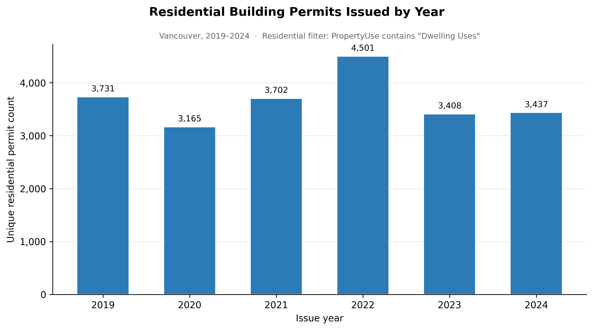
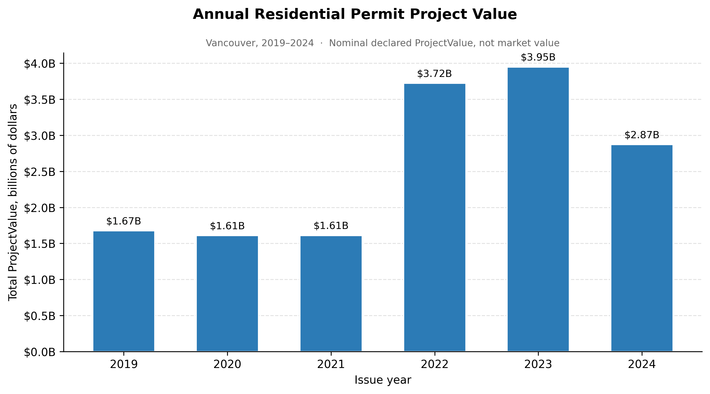
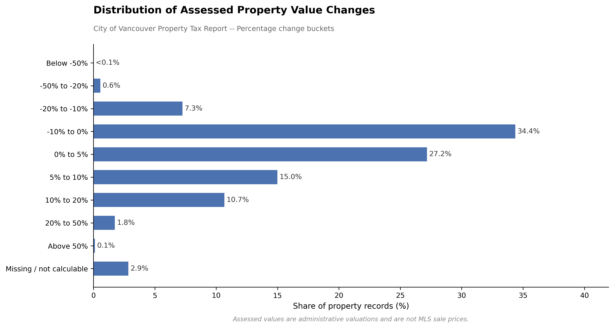
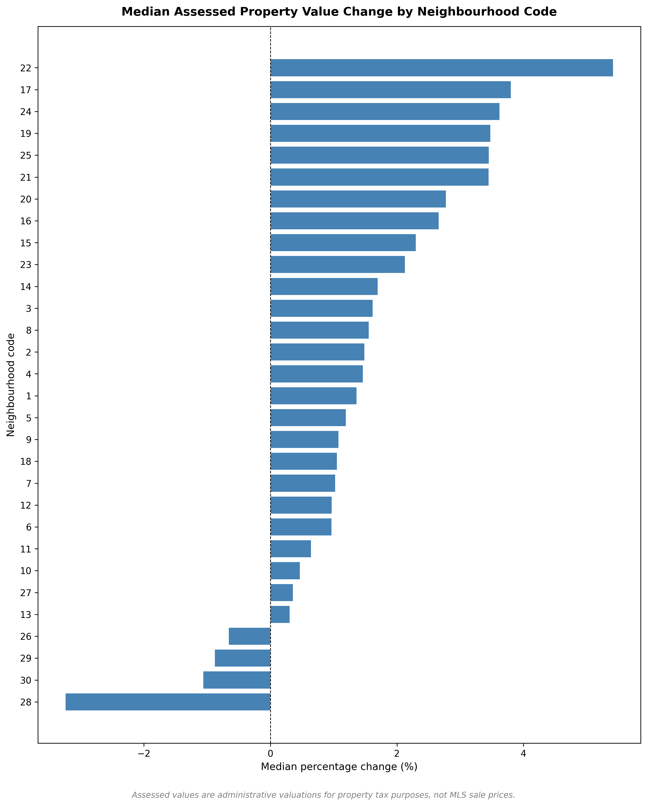
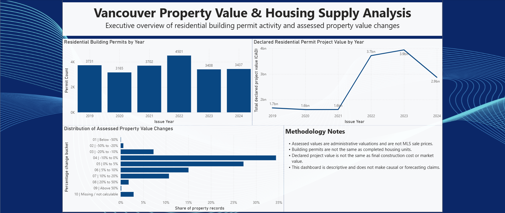
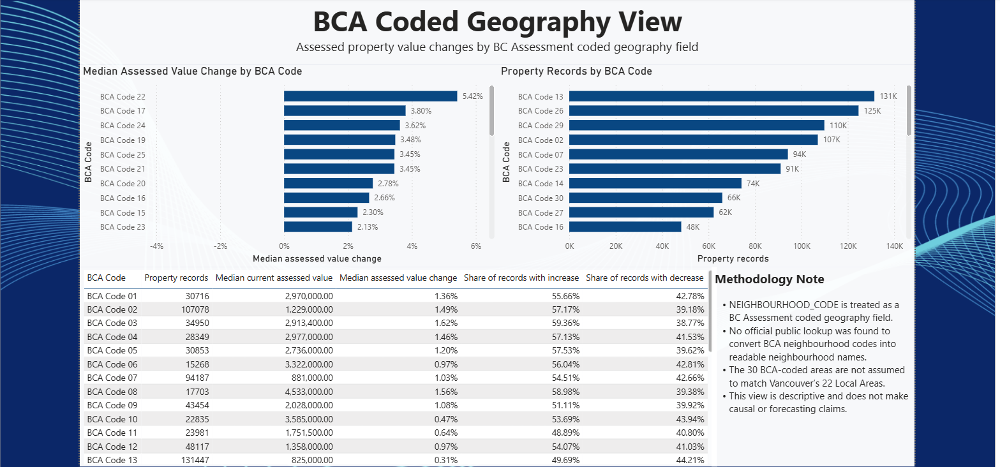

# Vancouver Property Value & Housing Supply Analysis

A reproducible Python analytics project exploring assessed property values and residential building permit activity in Vancouver, built entirely from public City of Vancouver Open Data. The pipeline runs from raw source files through validated, documented processed outputs and portfolio-ready visualizations.

---

## Recruiter Snapshot

- **Public data analysis** — two City of Vancouver Open Data datasets combined in a single documented pipeline
- **Data cleaning & feature engineering** — null-safe derived metrics with explicit validation checks at every stage
- **Large-dataset processing** — 443 MB Property Tax Report processed in 100,000-row chunks using `pd.read_csv(..., chunksize=...)`
- **Descriptive visualization** — four portfolio-ready charts exported at 300 dpi with proper caveats
- **Reproducible workflow** — numbered notebooks, immutable raw data, committed processed outputs, full methodology documentation
- **Business communication** — findings documented for a non-technical audience with honest scope and limitations
- **Power BI dashboard** — two-page descriptive dashboard built from processed CSV outputs; screenshots included

---

## Business Question

> How can public property assessment and building permit data be used to describe patterns in assessed property value changes and residential permit activity in Vancouver?

This is a descriptive analytics question answered from administrative records. The project does not claim that permit activity caused property value changes, and does not forecast future prices or permit volumes.

---

## How to Read This Project

| Layer | What it contains |
|---|---|
| `notebooks/` | Numbered Python notebooks — the reproducible workflow, run in order |
| `data/processed/` | Small, validated CSV outputs committed to Git — inputs to visualization notebooks and the Power BI dashboard |
| `visuals/` | Exported charts summarizing the processed outputs |
| `docs/` | Methodology decisions, data dictionary, dataset log, and analysis narrative |

---

## Data Sources

| Dataset | Source | Role | Status |
|---|---|---|---|
| Property Tax Report | City of Vancouver Open Data | Assessed values — land, improvements, year-over-year change | Downloaded; processed |
| Issued Building Permits | City of Vancouver Open Data | Residential permit activity and declared project value by year | Downloaded; filtered and exported |
| StatCan / CMHC contextual data | Statistics Canada / CMHC | Optional future context | Not in current pipeline |

Raw files are excluded from version control via `.gitignore`. Dataset inclusion decisions are logged in [`docs/dataset_decision_log.md`](docs/dataset_decision_log.md).

---

## Key Outputs

### Processed Files

All files below are small, validated, and tracked in Git. They serve as inputs to visualization notebooks and the Power BI dashboard.

| File | Rows | Description |
|---|---|---|
| `data/processed/permit_count_by_year.csv` | 6 | Distinct residential permits issued per year, 2019–2024 |
| `data/processed/permit_project_value_by_year.csv` | 6 | Annual sum, median, mean, and count of declared `ProjectValue` for residential permits |
| `data/processed/property_value_change_summary.csv` | 4 | Quality-control summary for the four derived assessed-value change metrics |
| `data/processed/property_value_change_distribution_bins.csv` | 10 | Distribution of year-over-year assessed value changes across 1,552,663 property records, binned into 10 percentage-change buckets |
| `data/processed/property_value_change_by_neighbourhood.csv` | 30 | Assessed-value change metrics aggregated by `neighbourhood_code` — 30 BCA-coded geography areas, 18 columns, 1,552,663 records represented |

> `data/processed/property_value_change_distribution.csv` is generated locally during processing (~68.47 MB) but excluded from Git. It is an intermediate file used to produce the binned summary above.

### Visual Outputs

#### Annual Residential Permit Count



Annual count of distinct residential building permits issued in Vancouver, 2019–2024. Measures permitting activity, not completed housing units.

#### Annual Residential Permit Project Value



Annual sum of declared `ProjectValue` for residential permits, 2019–2024. `ProjectValue` is the applicant-declared project value — it is not the same as final construction cost or market value, and is not independently verified at issuance.

#### Assessed Property Value Change Distribution



Distribution of year-over-year assessed property value changes across all property records in the Property Tax Report, grouped into 10 percentage-change buckets. Assessed values are administrative property valuations used for property tax purposes — not MLS sale prices.

#### Median Assessed Property Value Change by Neighbourhood Code



Median year-over-year assessed value change by `neighbourhood_code`. Neighbourhood codes are BCA-coded geography fields, not readable neighbourhood names. See the Geography Limitation section below.

---

## Power BI Dashboard

The project includes a two-page Power BI dashboard built from the processed analytical outputs.

**Dashboard file:** [`dashboard/Vancouver_Property_Value_Housing_Supply_Analysis.pbix`](dashboard/Vancouver_Property_Value_Housing_Supply_Analysis.pbix)

### Page 1: Executive Overview

Summarizes residential building permit activity by year, declared residential permit project value by year, and the distribution of assessed property value changes across all property records.



### Page 2: BCA-Coded Geography View

Shows assessed property value change patterns by `NEIGHBOURHOOD_CODE`, treated as a BC Assessment coded geography field. Displays median percentage value change, property counts, and shares of properties with assessed value increases and decreases across the 30 BCA-coded areas.



See [`dashboard/README.md`](dashboard/README.md) for the full build plan, data source list, KPIs, and methodology notes.

---

## Repository Structure

```
data/
  raw/            # Original source files -- never modified, excluded from Git
  processed/      # Small validated outputs -- tracked in Git
notebooks/        # Numbered Jupyter notebooks, run in order
docs/             # Methodology, data dictionary, dataset log, analysis narrative
visuals/          # Exported charts (300 dpi PNG)
dashboard/        # Power BI dashboard, screenshots, and build documentation
src/              # Reusable scripts extracted from notebooks (future)
```

---

## Methodology Summary

- Raw files in `data/raw/` are treated as immutable. All cleaning and derivation happens in notebooks and outputs go to `data/processed/`.
- Large raw files (56 MB+) are excluded from Git. Only small, validated derived outputs are committed.
- Derived metrics are validated at every stage with explicit assertion checks before results are committed.
- Permit counts use `nunique()` on `PermitNumber` to avoid inflating counts from amended or reissued permits.
- Residential permits are isolated by filtering `PropertyUse` for `"Dwelling Uses"` (case-insensitive, null-safe) — more reliable than `PermitCategory`, which has a high null rate in the full dataset.
- The 443 MB Property Tax Report was processed in 100,000-row chunks. The row-level output (~68.47 MB) is local-only; the Git-tracked output is a 10-row binned summary.
- Outliers and extreme percentage changes are flagged with quality-control counts but not removed — they may reflect legitimate events such as redevelopment or zoning reclassification.
- Property-value metrics were also aggregated by `NEIGHBOURHOOD_CODE` using the same chunked pipeline, producing a 30-row portfolio-ready neighbourhood-code-level summary.

Full methodology is documented in [`docs/methodology.md`](docs/methodology.md).

---

## Geography Limitation

`NEIGHBOURHOOD_CODE` in the Property Tax Report is a 3-digit code assigned by BC Assessment (BCA) — not a readable neighbourhood name. The City of Vancouver publishes the code but does not publish a corresponding name field. According to City documentation, BCA does not supply the City with the referencing neighbourhood name information.

No free official public lookup was found during research that maps these codes to readable names. The project therefore keeps this field as `neighbourhood_code` in all outputs and does not substitute guessed labels. The 30 BCA-coded areas are not assumed to match the City of Vancouver's 22 Local Areas — these are distinct geography systems.

A future enhancement could obtain an official BC Assessment mapping or build a separate City Local Area analysis using an appropriate spatial method.

---

## Key Caveats

- **Assessed value ≠ sale price.** BC Assessment valuations are administrative estimates for property tax purposes, not MLS transaction prices or market value.
- **Permits ≠ completed housing units.** A permit is an authorisation to begin construction. It does not confirm the project was completed, occupied, or added to housing stock.
- **`ProjectValue` ≠ final construction cost or market value.** It is applicant-declared at issuance and not independently verified. Totals are nominal — no inflation adjustment applied.
- **Large projects can skew totals.** `median_project_value` is included as a more robust alternative to the annual mean.
- **`NEIGHBOURHOOD_CODE` is a coded field, not a readable name.** No official public mapping was found to translate these codes. They are not equivalent to the City of Vancouver's 22 Local Areas.
- **This project is descriptive, not causal.** Differences in assessed value change across neighbourhood codes or across years do not imply that any specific factor caused those differences. No forecasting is made.

---

## Current Project Status

**Completed**

- [x] Project scaffold and repo conventions
- [x] Raw data acquisition and dataset decision log
- [x] Initial data understanding and EDA (Notebook 01)
- [x] Property value feature engineering with validation (Notebook 02)
- [x] Residential permit metrics with validation (Notebook 03)
- [x] Processed annual permit exports to `data/processed/`
- [x] Data dictionary, methodology, and dataset decision log
- [x] Permit trend visualizations (Notebook 04)
- [x] Full Property Tax Report processed with chunked reading and validated exports (Notebooks 05–06)
- [x] Assessed value change distribution visualized from processed binned output (Notebook 07)
- [x] Neighbourhood-code-level property value output: 30-row aggregated summary across 1,552,663 property records (Notebook 08)
- [x] Neighbourhood-code-level property value visualization exported to `visuals/` (Notebook 09)
- [x] Neighbourhood code mapping investigation — official mapping not found; limitation documented (Notebook 10)
- [x] Analysis narrative written (`docs/analysis_narrative.md`)
- [x] Power BI dashboard using processed CSV outputs (permit counts, project value, distribution bins, neighbourhood-code summary)

**Next**

- [ ] Cross-dataset alignment — joining permit and property tax data by area and year
- [ ] City Local Area analysis using spatial assignment (separate from BCA neighbourhood codes)

---

## Skills Demonstrated

`Python` | `pandas` | `data cleaning` | `feature engineering` | `chunked large-file processing` | `data validation` | `descriptive visualization` | `Git / GitHub workflow` | `methodology documentation` | `business communication` | `public-data analysis`

---

## Documentation

- [Analysis Narrative](docs/analysis_narrative.md)
- [Methodology](docs/methodology.md)
- [Data Dictionary](docs/data_dictionary.md)
- [Dataset Decision Log](docs/dataset_decision_log.md)
- [Business Narrative](docs/business_narrative.md)

---

## Setup

```bash
python -m venv .venv
.venv\Scripts\activate      # Windows
# source .venv/bin/activate  # macOS / Linux
pip install -r requirements.txt
jupyter notebook
```
